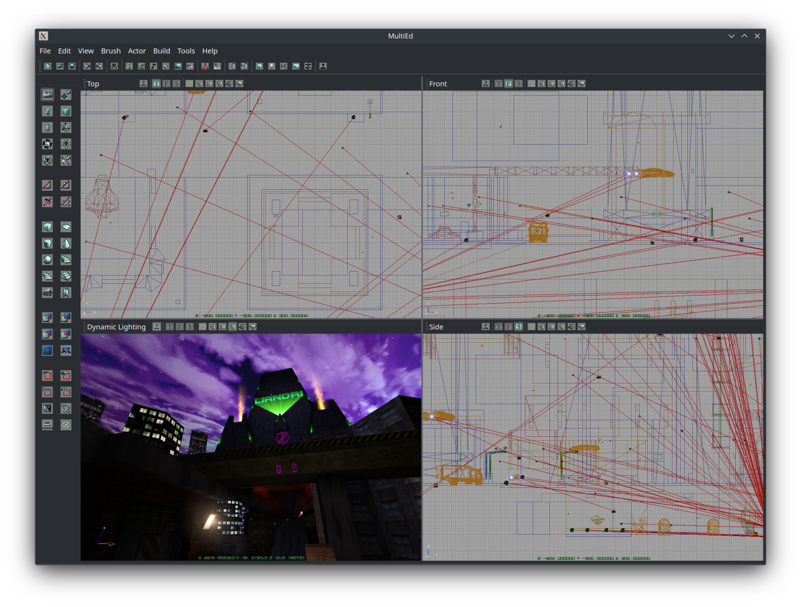

# MultiEd

An QT6 based open source frontend for the OldUnreal Unreal Engine 1 games. 

## State of the Project

This started out as a rough prototype, and then I dropped it for a few years. (oops)

There's a lot of jank in this setup process, but I'm hoping to get this project going and smooth it out in the long-term. 

If you're confused or horrified by the code, so am I! We'll get there :^)

## Building

Symlink/Place your OldUnreal UT SDK/Development copy into libs/OldUnrealSDK, ensure you have QT6 development libraries installed and build!

There are patch files located in `./patches` which will fix some crash and navigation issues. For now you'll have to take the latest UTSDK469d from the OldUnreal project, apply the patch files and compile SDLDrv and OpenGLDrv.

## Running

### Wayland 
**YOU MUST RUN THIS IN XWAYLAND / X11 MODE**
  
This application relies on embedding foreign windows, which isn't supported by QT on wayland. Please run with `QT_QPA_PLATFORM=xcb`.

### First Run / Setup

On first load MultiEd will generate a MultiEd.ini file in the OldUnreal user data directory. (`~/.utpg/System` on linux.)

Once that file is created you'll need to make some tweaks (at least on Linux):

Under `Engine.Engine` change the various `RenderDevice` lines to `OpenGLDrv.OpenGLRenderDevice`
Under `Engine.Engine` change `ViewportManager` to `SDLDrv.SDLClient`
Under `SDLDrv.SDLClient` change `StartupFullscreen=True` to `StartupFullscreen=False`

To resolve any missing icons copy the `res` folder from this repo into `System64/MultiEd`.

Copy the `editorres` folder from the `res` folder and copy that into `System64`. 

## Special Thanks

To the OldUnreal team for giving me early access to their updated SDK.